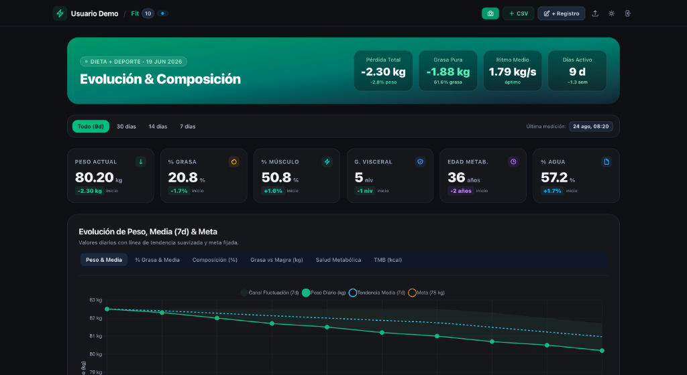

# ⚡ Fit Evolution & Body Composition Dashboard

> **Personal Fitness & Health Evolution Dashboard** with bioimpedance telemetry (RENPHO / Fitbit), multi-metric trend analysis, automated target forecasting, and zero-database architecture.

[](https://astro.build)
[](https://tailwindcss.com)
[](https://www.chartjs.org/)
[](LICENSE)

<p align="center">
  
</p>

---

## ✨ Features

- **🚀 Zero-Database Architecture**: Runs completely client-side via `localStorage` by default, with optional serverless edge sync to a private GitHub Gist.
- **📊 Advanced Bioimpedance Metrics**: Weight, Body Fat %, Skeletal Muscle %, Visceral Fat, Body Water %, Metabolic Age, BMR, Bone Mass, Subcutaneous Fat, and **Normalized FFMI** (Fat-Free Mass Index tailored to user height).
- **📈 Interactive Trend Analytics**: Multi-tab Chart.js charts with 7-day rolling moving averages, min-max fluctuation bands, and visual target goal lines.
- **🎯 Target Goals & Forecasting**: Live progress tracking for Weight and Body Fat % with real-time ETA forecasting based on rolling weekly rhythm.
- **⚡ Milestones & Plateau Intelligence**: Historical lowest weight records, milestone barriers broken, best week detection, and 14-day rolling average plateau detection.
- **🔬 Recomposition Analysis (Day 1 vs Today)**: Partitioning P-Ratio bar (fat loss vs lean mass retention), head-to-head metric shifts, and visual equivalences (e.g., packages of butter eliminated, calorie deficits).
- **📱 iPhone 16 Pro PWA**: Standalone installable progressive web app optimized for Dynamic Island and iOS safe areas.
- **📸 HD Infographic Report Exporter**: In-browser canvas renderer that generates high-resolution social/personal progress summary images with native Web Share API support.
- **📁 CSV Import & Export**: Direct integration with RENPHO Smart Scale CSV exports, manual entry form, and instant CSV / JSON full backups.
- **🔒 Privacy First**: Server-side login (PBKDF2 + signed HttpOnly session cookie); your data never leaves your own Gist.

---

## 🚀 Quick Start (Local Setup)

Clone the repository and start the development server in 3 simple steps:

```bash
# 1. Clone the repository
git clone https://github.com/pacoforet/fit.pacoforet.com.git
cd fit.pacoforet.com

# 2. Install dependencies
npm install

# 3. Start local development server
npm run dev
```

Open [http://localhost:4321](http://localhost:4321) in your browser.

---

## ⚙️ Configuration & Customization

Copy the template file:
```bash
cp .env.example .env
```

### 1. Setting Your Login (User & Password)

The login is checked on the server (`/api/session`) against a salted PBKDF2 hash, and a signed `HttpOnly` cookie authorizes the sync API. Nothing secret is shipped to the browser. Generate your hash:

```bash
npm run auth:hash
```

The script asks for your username and then the password (without echoing it). Copy the result into your `.env` (or Vercel Environment Variables, as a *Sensitive* variable):
```env
FIT_PASSWORD_HASH=pbkdf2-sha256:210000:...
```

If `FIT_PASSWORD_HASH` is not set, login is disabled and the API rejects every request. The **Demo mode** (user `demo`, password `demo`, or the demo button) keeps working entirely in the browser with sample data. Changing the password invalidates every open session.

> **Note:** `npm run dev` only serves the frontend. To test login and sync locally, use `vercel dev`.

### 2. Cloud Sync with GitHub Gist (Multi-Device)

If you want your weigh-ins to sync automatically across all your devices (iPhone, laptop, tablet) without paying for a database:

1. Create a **fine-grained GitHub token** at [GitHub Token Settings](https://github.com/settings/personal-access-tokens) with only the **Gists: Read and write** account permission and an expiration date.
2. Create an empty secret Gist at [gist.github.com](https://gist.github.com) (e.g. named `fit-data.json` with `{}`).
3. Copy the Gist ID from the URL (the hexadecimal string at the end).
4. Set the variables in your `.env` or Vercel:
   ```env
   FIT_GITHUB_TOKEN=tu_github_token_aqui
   FIT_GIST_ID=tu_gist_id_aqui
   ```

*If these variables are omitted, the dashboard automatically operates in **Local Storage Mode**.*

### 3. Personalizing Your Profile & Height

Click on **"Ajustar Metas"** in the dashboard to set:
- Your name (updates title, header, and exported report images).
- Your height (used to accurately normalize your **FFMI** and **BMI**).
- Your target weight and body fat percentage.

To start fresh with your own weigh-ins, open the **+ CSV** button and click **"Vaciar Registros / Empezar de Cero"**, then drag and drop your exported RENPHO CSV file.

---

## 🚢 Deployment to Vercel

You can deploy your own instance to Vercel for free in seconds:

1. Fork or push this repository to your GitHub account.
2. Import the project into [Vercel](https://vercel.com).
3. In **Project Settings -> Environment Variables**, add:
   - `FIT_GITHUB_TOKEN` (optional, for Gist sync)
   - `FIT_GIST_ID` (optional, for Gist sync)
   - `FIT_PASSWORD_HASH` (required for login and sync, generated with `npm run auth:hash`)
4. Click **Deploy**.

---

## 🛠️ Tech Stack

- **Framework**: [Astro 6](https://astro.build)
- **Styling**: [Tailwind CSS v4](https://tailwindcss.com)
- **Charts**: [Chart.js 4](https://www.chartjs.org/)
- **Runtime / API**: [Vercel Edge Functions](https://vercel.com/docs/functions)
- **Persistence**: Browser `localStorage` + GitHub Gist API

---

## 📄 License

This project is licensed under the [MIT License](LICENSE) — feel free to use, modify, and self-host for personal or community use.
