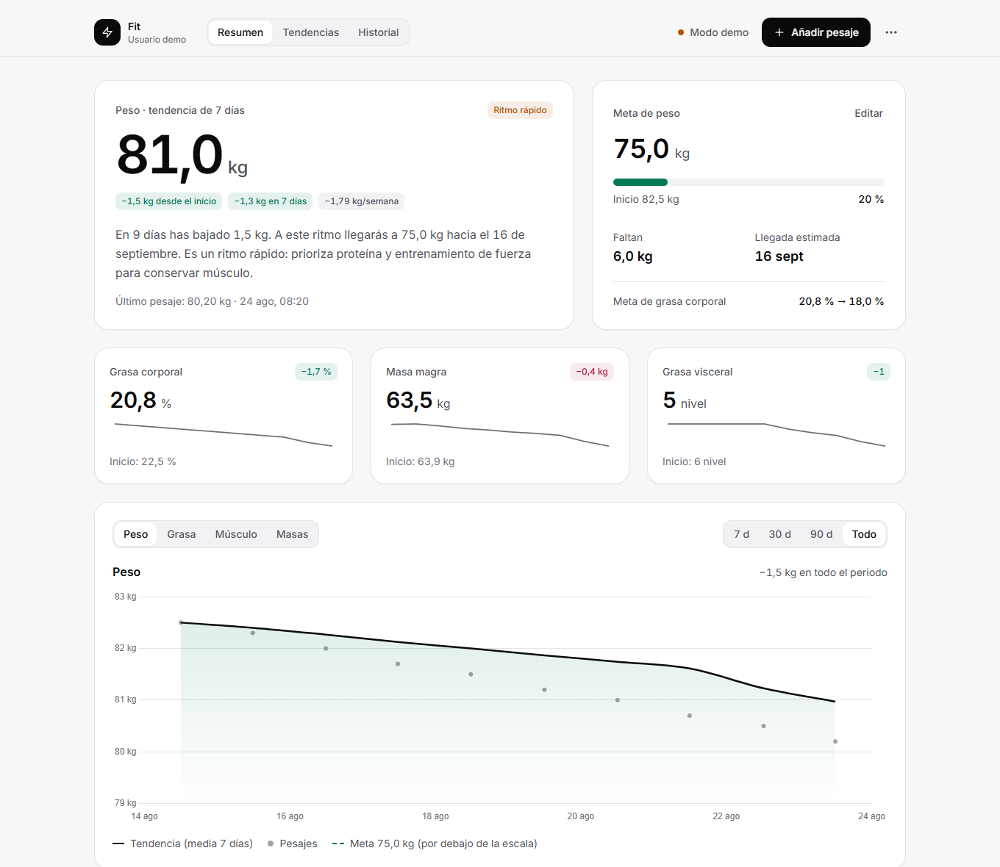
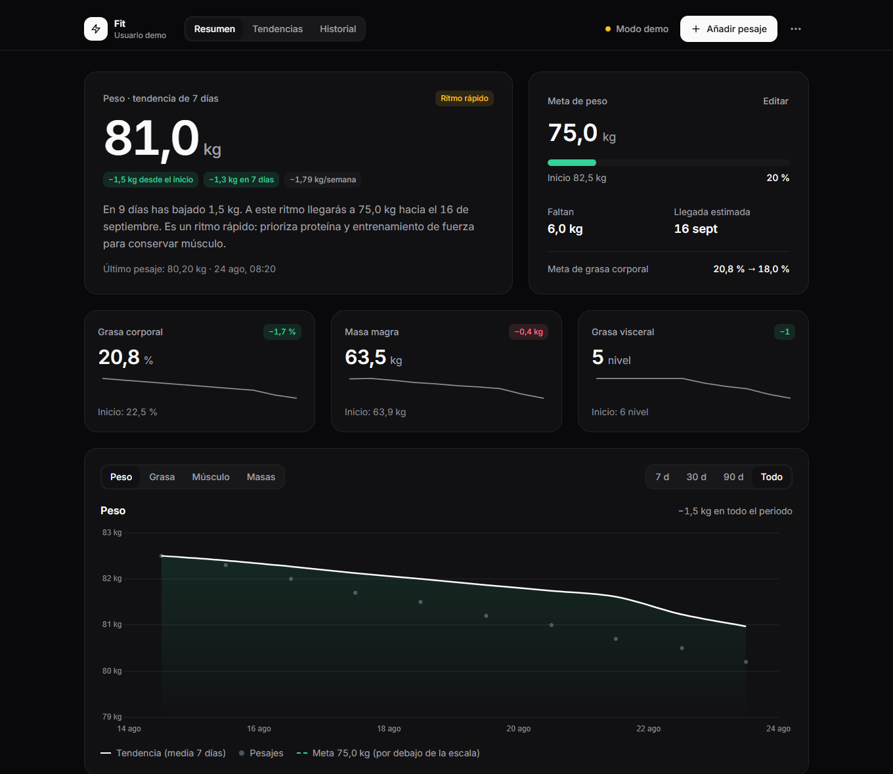
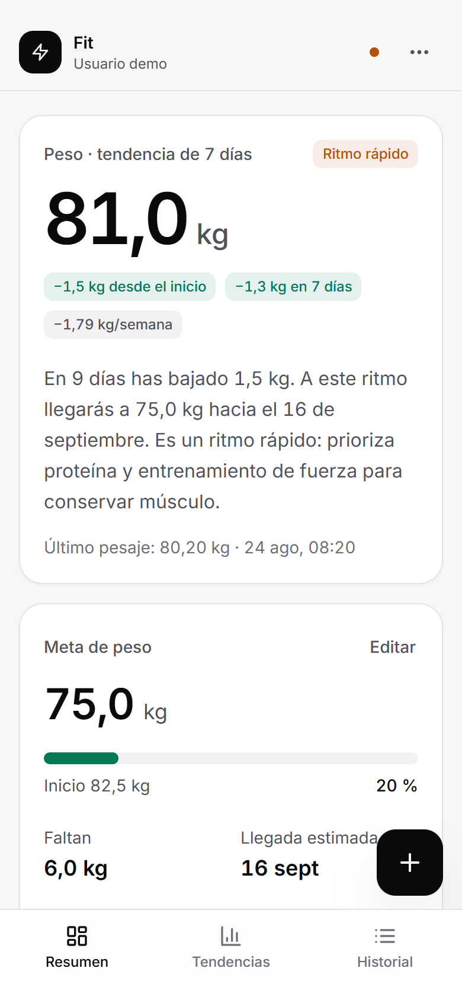

# ⚡ Fit Dashboard

> A private, self-hosted dashboard for your weight and body composition. Import the CSV from your RENPHO smart scale, see your real trend without the day-to-day noise, and sync across devices through a private GitHub Gist. No database, no subscription.

[](https://astro.build)
[](https://tailwindcss.com)
[](https://www.chartjs.org/)
[](LICENSE)

<p align="center">
  
</p>

<p align="center">
  
  &nbsp;
  
</p>

> The interface is in Spanish (numbers and dates use the `es-ES` format).

---

## ✨ Features

**Summary — "am I on track?" at a glance**
- Weight shown as a **7-day trend**, so water and food swings don't hide your real progress.
- Change since the start and over the last 7 days, weekly rate, and a **pace label** based on % of body weight per week (healthy, fast, slow, stable, moving away from the goal).
- A plain-language insight ("In 39 days you've lost 2.6 kg. At this pace you'll reach 77 kg around 8 November").
- Goal card with progress, kilos left and **estimated arrival date**.
- Key body metrics (body fat, lean mass, visceral fat) with sparklines.
- Main chart on a real time axis: trend line, daily weigh-ins, labelled goal line, crosshair tooltip. Switch between weight, body fat, muscle and fat vs lean mass, over 7 days, 30 days, 90 days or everything.
- **What you've lost**: how much of the weight lost was fat vs lean mass, with a quality rating.
- **Milestones** timeline: start, round numbers crossed, historical low, best week, next milestone and goal.

**Trends**
- Weekly average change as a bar chart and table.
- Every metric the scale records (fat mass, lean mass, skeletal muscle, visceral and subcutaneous fat, water, protein, bone mass, BMR, metabolic age, BMI) plus a height-normalized **FFMI**.

**History**
- Search by date, choose visible columns, paginate, delete with **undo**.

**Everything else**
- Import RENPHO CSV exports (Spanish or English headers), add weigh-ins manually, export CSV or full JSON backups.
- Shareable **1080 × 1350 progress image** (native share sheet on phones).
- Light and dark themes, installable as a PWA, works on phones with a bottom navigation bar.
- Accessible: native dialogs, keyboard navigation, visible focus, 40 px+ touch targets, reduced-motion support.
- **Demo mode** with sample data, so anyone can try it without an account.

---

## 🧭 How it works

```
Browser (Astro static page)
  │  localStorage ── your weigh-ins are always kept on the device
  │
  ├─ POST /api/session ──► checks your password (PBKDF2) and sets a signed HttpOnly cookie
  └─ GET/POST /api/fit-sync ──► requires that cookie ──► reads / writes a private GitHub Gist
```

- The frontend is a static Astro site. The two API routes are Vercel Edge Functions in [`api/`](api).
- Your data lives in **your own private Gist**. The server only holds a GitHub token and a password hash, never your data.
- Without Gist variables the dashboard still works, storing data only in the browser (the header shows "Solo en este dispositivo").

---

## 🚀 Try it locally

Requires Node.js 22.12 or newer.

```bash
git clone https://github.com/pacoforet/fit.pacoforet.com.git
cd fit.pacoforet.com
npm install
npm run dev
```

Open [http://localhost:4321](http://localhost:4321) and click **"Ver la demo con datos de ejemplo"**.

`npm run dev` serves only the frontend, so the demo works but login and sync don't. To run the API locally too, install the [Vercel CLI](https://vercel.com/docs/cli) and use `vercel dev` with a `.env` file (see below).

---

## 🚢 Deploy your own dashboard

It takes about 10 minutes and fits in the free tiers of Vercel and GitHub.

### 1. Fork and import into Vercel

1. Fork this repository.
2. In [Vercel](https://vercel.com/new), import your fork. The framework (Astro) is detected automatically; don't deploy yet, or deploy and redeploy after step 4.

### 2. Create a private Gist for your data

1. Go to [gist.github.com](https://gist.github.com) and create a **secret** Gist with a file named `fit-data.json` containing `{}`.
2. Copy the Gist ID: the long hexadecimal string at the end of its URL.

### 3. Create a GitHub token that can only touch Gists

1. Open [Fine-grained tokens](https://github.com/settings/personal-access-tokens/new).
2. Set an expiration date, and under **Account permissions** give **Gists: Read and write**. Nothing else.
3. Copy the token.

### 4. Generate your password hash

In your local clone:

```bash
npm run auth:hash
```

It asks for a username and a password (at least 10 characters, typed without echo) and prints a line like:

```env
FIT_PASSWORD_HASH=pbkdf2-sha256:210000:<salt>:<hash>
```

Copy only the value after `=`. The username is case-sensitive.

### 5. Add the environment variables in Vercel

In **Project → Settings → Environment Variables**, add them for Production (and Preview if you want preview deployments to work):

| Variable | Required | Description |
| --- | --- | --- |
| `FIT_PASSWORD_HASH` | Yes | Output of `npm run auth:hash`. Mark it as **Sensitive**. Without it, login is disabled and the API rejects everything. |
| `FIT_GITHUB_TOKEN` | For sync | Fine-grained token with Gists read/write. Mark it as **Sensitive**. |
| `FIT_GIST_ID` | For sync | ID of your private Gist. |
| `FIT_GIST_FILENAME` | No | File inside the Gist. Defaults to `fit-data.json`. |
| `PUBLIC_USER_NAME` | No | Default display name before you set one in "Metas y perfil". It is public (embedded in the page). |

Then **redeploy** so the new variables are picked up.

### 6. First login and your data

1. Open your deployment and sign in with the username and password from step 4.
2. In the RENPHO app, export your data as CSV, then in the dashboard open **⋯ → Importar CSV de RENPHO** and drop the file.
3. Open **⋯ → Metas y perfil** to set your name, height, and weight and body-fat goals.

Your weigh-ins are now synced: open the dashboard on another device, sign in, and everything is there.

---

## 🔒 Security model

- Passwords are verified on the server with salted PBKDF2-SHA256 (210,000 iterations). Nothing secret is sent to the browser.
- Sessions are stateless cookies signed with HMAC (`HttpOnly; Secure; SameSite=Strict`, 30 days). Changing `FIT_PASSWORD_HASH` signs everyone out.
- The sync API rejects requests without a valid session, cross-origin writes, and malformed records. Every record is validated and sanitized before it reaches the Gist.
- Security headers (CSP, `X-Frame-Options`, `nosniff`, `Referrer-Policy`) are set in [`vercel.json`](vercel.json). All scripts and fonts are self-hosted.
- `robots.txt` and `noindex` keep the dashboard out of search engines.

To rotate your password, run `npm run auth:hash` again, update `FIT_PASSWORD_HASH` in Vercel and redeploy.

---

## 🛠️ Project structure

```
api/
  _auth.ts          Password hashing, signed session cookies, helpers
  session.ts        POST login · GET status · DELETE logout
  fit-sync.ts       Read/write the Gist (session required, records validated)
scripts/
  generate-auth.mjs npm run auth:hash
src/
  pages/index.astro Page shell: assembles components and loads the app script
  components/       Header, bottom nav, login, views and dialogs (Astro)
  lib/
    metrics.ts      Pure calculations: trend, pace, goal ETA, weekly stats, milestones
    store.ts        App state and localStorage persistence
    sync.ts         Merge and sync with the API
    charts.ts       Chart.js charts and SVG sparklines
    csv.ts          RENPHO CSV import/export
    report.ts       Shareable progress image
    ui.ts           Dialogs, confirm, toasts, menus, theme
    format.ts       Spanish number and date formatting
  scripts/
    app.ts          Entry point: auth, routing and actions
    render/         Rendering for each view
  styles/global.css Design tokens (colors, type) and shared components
  data/             Sample data for the demo
```

### Customizing the look

All colors are semantic tokens defined once in [`src/styles/global.css`](src/styles/global.css) for light and dark themes (`--accent`, `--positive`, `--negative`, `--surface`…). Change them there and the whole dashboard, charts included, follows.

### Scripts

| Command | What it does |
| --- | --- |
| `npm run dev` | Frontend dev server at `localhost:4321` (demo only) |
| `npm run build` | Production build into `dist/` |
| `npm run preview` | Serve the production build locally |
| `npm run auth:hash` | Generate `FIT_PASSWORD_HASH` |

---

## ❓ Troubleshooting

| Symptom | Cause and fix |
| --- | --- |
| Login always says the credentials are wrong | The username or password differ from the ones used in `npm run auth:hash` (the username is case-sensitive). Generate a new hash and redeploy. |
| `/api/session` answers `503 FIT_PASSWORD_HASH not configured` | The variable is missing, empty or pasted incorrectly (it must be one line `pbkdf2-sha256:210000:…:…` without quotes). Fix it and **redeploy**. |
| Header shows "Solo en este dispositivo" | `FIT_GITHUB_TOKEN` or `FIT_GIST_ID` are not set. Data stays in this browser only. |
| Header shows "Error al sincronizar" | The token expired or lacks the Gists permission, or the Gist ID is wrong. |
| Login and sync don't work with `npm run dev` | Expected: the API only runs on Vercel or with `vercel dev`. |

---

## 🧰 Tech stack

- **Framework**: [Astro 6](https://astro.build) (static output) + TypeScript
- **Styling**: [Tailwind CSS v4](https://tailwindcss.com) with semantic design tokens
- **Charts**: [Chart.js 4](https://www.chartjs.org/) (bundled, tree-shaken)
- **Typography**: [Inter](https://rsms.me/inter/) (self-hosted via Fontsource)
- **Icons**: [Lucide](https://lucide.dev) (inlined SVG)
- **API**: [Vercel Edge Functions](https://vercel.com/docs/functions) with WebCrypto
- **Persistence**: browser `localStorage` + a private GitHub Gist

---

## 📄 License

[MIT](LICENSE). Use it, modify it and self-host it for yourself or your community.
